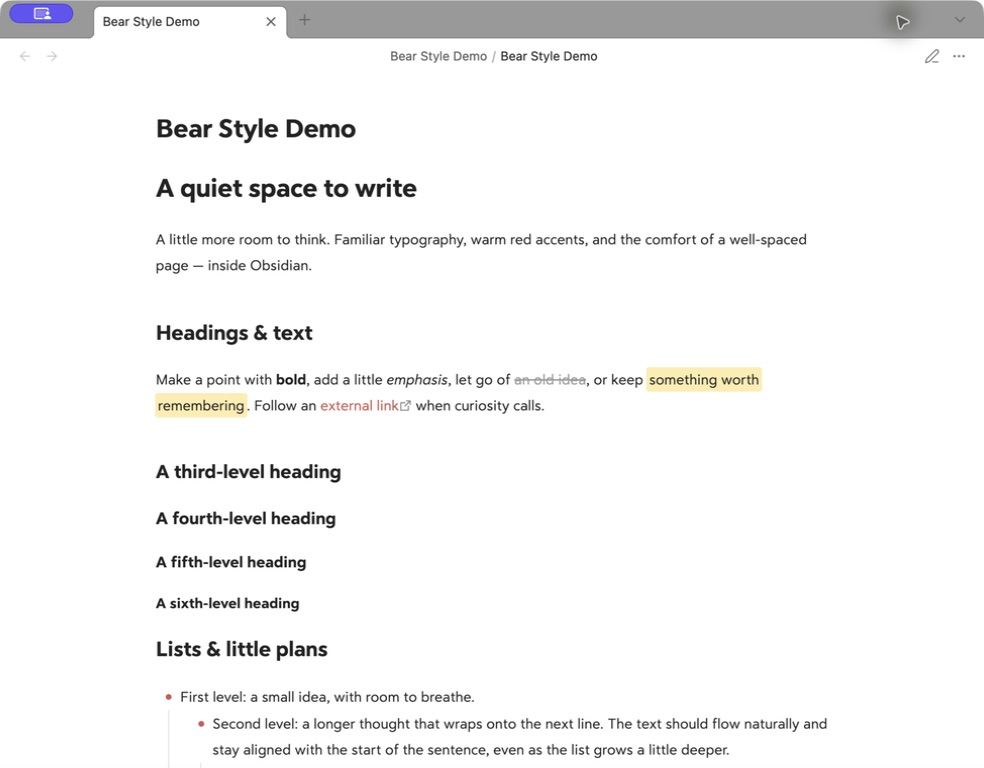
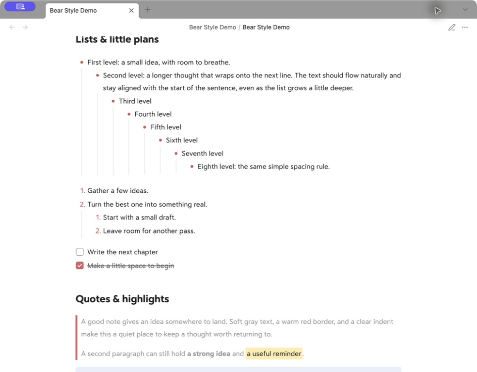
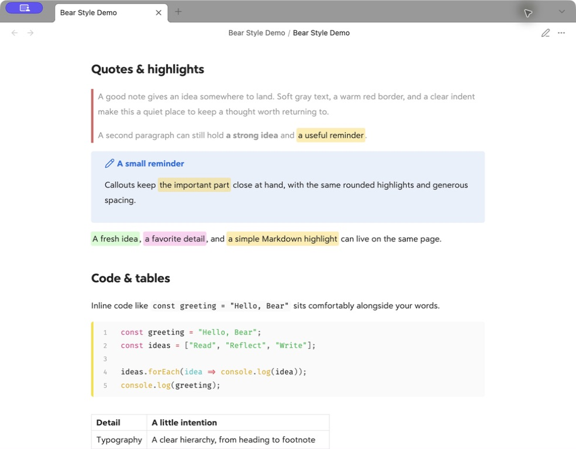
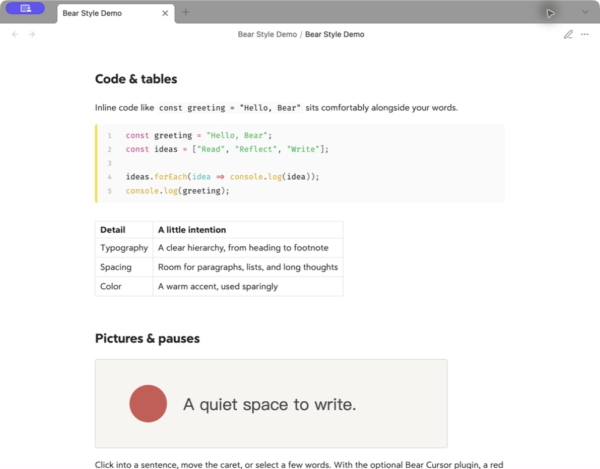
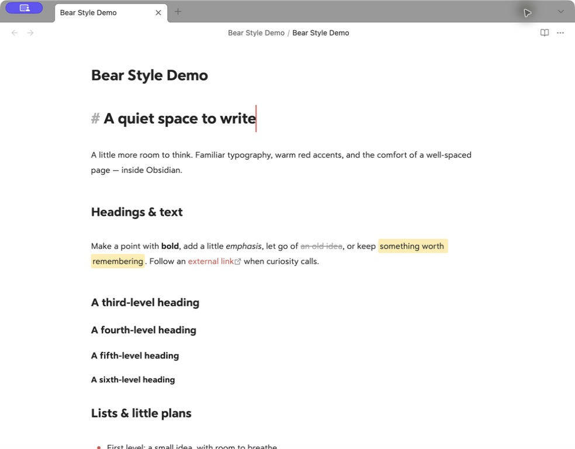

# Obsidian Bear Style

A quiet space to write. Bear-inspired typography, warm red accents, generous spacing, and an optional red **2px caret** for Obsidian.

[中文说明](README.zh-CN.md) · [Download](https://github.com/cherishh/obsidian-bear-style/releases/latest) · [Demo note](examples/Bear%20Style%20Demo.md)



This is a **CSS snippet for Obsidian's default theme**, plus a small optional desktop cursor plugin. It is not a standalone community theme. The snippet works without community plugins.

> **About the screenshots:** these are real captures of the included English demo in Obsidian on macOS. Matching this setup closely also depends on fonts and optional plugins: **Highlightr** for the colored highlights, **Code Styler** for code blocks, and **Bear Cursor** for the thick red caret. See [Match the screenshots](#match-the-screenshots). Installing the CSS alone will not reproduce every detail.

## Install with your AI agent

Copy the prompt below into an agent with access to your local files and Obsidian, such as Codex or Claude Code. It asks for the complete demo setup, including the two optional community plugins. The agent may need your vault path or help with an Obsidian permission prompt. A chat-only assistant cannot install files on your computer.

```text
Please install Obsidian Bear Style in my Obsidian vault and get the full demo
setup working, rather than only giving me instructions.

Project: https://github.com/cherishh/obsidian-bear-style
Read the current README, including “Match the screenshots” and compatibility
notes. Download the latest stable release from that repository.

1. Identify my intended vault, its actual configuration folder (normally
   .obsidian, but it can be customized), my OS, and Obsidian version. If the
   target vault is ambiguous, ask me which one before changing anything.

2. Back up the files and settings you will change to a dated local folder
   outside the active snippets/plugins directories. Preserve my notes and
   unrelated settings. Merge configuration changes instead of replacing whole
   JSON files. If Obsidian is running, use its settings UI or supported APIs;
   otherwise have it closed before editing configuration files so changes are
   not overwritten. Do not force-quit it or discard unsaved edits.

3. Install and enable bear.css. Use the Default theme, light mode, 15px text,
   accent #cd5853, and readable line length to match the screenshots, unless
   I have specified a different appearance preference. Preserve existing font
   choices. Disable conflicting appearance snippets only when necessary and
   record exactly what you changed.

4. On a compatible desktop installation, install and enable the included
   Bear Cursor plugin. Check its manifest for the minimum Obsidian version.
   Disable Ninja Cursor or another active cursor replacement if it conflicts;
   do not uninstall unrelated plugins. On mobile or an unsupported version,
   keep the native red caret and explain that the 2px replacement was skipped.
   Do not upgrade Obsidian without asking me.

5. Install and enable Highlightr (highlightr-plugin) and Code Styler
   (code-styler), then apply the screenshot settings documented in the README.
   Use Obsidian's community plugin browser or the official upstream repositories
   linked there. Reuse compatible installed versions; do not blindly downgrade
   them or erase other settings. These plugins are optional for the CSS alone,
   but I want them for this full setup. Respect any required permission prompts;
   if an action needs my help, finish the independent work and explain exactly
   what I need to do.

6. Copy the included English demo note and quiet-space.svg into a demo folder
   in my vault, keeping them together. Do not overwrite an existing note; reuse
   identical sample files or choose a new folder when they differ. Make repeat
   runs safe: no duplicate plugin entries, snippets, or unnecessary demo copies.

7. Reload Obsidian as needed and open the demo. Verify the snippet and plugins
   are actually enabled, the image resolves, colored highlights and code line
   numbers render, and the caret is visible while editing. Check a heading,
   a link, and a numbered list for duplicate carets. If you cannot inspect the
   running app, clearly separate files installed from behavior not yet verified;
   do not claim full success based only on copied files.

Do not download, extract, or install any fonts. Tell me that fonts are NOT
included: the screenshots use Bear Sans UI / Bear Sans UI Heading for text
and Fira Code / Roboto Mono for code. Without those already installed, my
existing fonts will be used and letter shapes and wrapping can differ.

Finish with a short summary of what was installed and verified, anything
skipped or still requiring my action, the backup location, and how to undo
your changes. Keep all of my vault contents and backups local.
```

Prefer to install only the essentials? Use the [manual installation steps](#install-the-style) below; Highlightr and Code Styler are not required for the CSS.

## A look around

Eight levels of nested lists, numbered lists, tasks, and a softer place for a quote:



Quotes, callouts, and colored highlights:



Code, a table, and an image:



The optional caret in Live Preview (blink held at its visible phase for this still):



## Install the style

1. Download **`obsidian-bear-style-v1.0.0.zip`** from [Releases](https://github.com/cherishh/obsidian-bear-style/releases/latest) and extract it.
2. In Obsidian, choose the **Default** theme under **Settings → Appearance**.
3. Under **CSS snippets**, click the folder button. Copy `snippets/bear.css` into that folder.
4. Return to Obsidian, reload the snippet list if needed, and enable **bear**.
5. Set **Appearance → Accent color** to **`#cd5853`**. Use a **15px** text size as a starting point.

No build step, package manager, or theme settings plugin is needed. See Obsidian's [official CSS snippet instructions](https://help.obsidian.md/snippets).

### Optional: the red 2px caret

1. Copy the entire `plugins/bear-cursor` folder from the download to `<your vault>/.obsidian/plugins/bear-cursor/`.
2. Confirm it contains `manifest.json`, `main.js`, and `styles.css` directly inside that folder.
3. Reload Obsidian. Under **Settings → Community plugins**, enable community plugins if needed, then enable **Bear Cursor**.

Bear Cursor is manually installed from this repository; it is not listed in the community plugin directory and does not have automatic updates. For updates, disable it, replace those three files, reload Obsidian, then enable it again.

The plugin uses CodeMirror's editor layer API to draw the primary caret. It follows the current line height, fades gently, and respects reduced-motion preferences. It makes no network requests and stores no settings. Text selections and secondary cursors remain under Obsidian's control.

Without the plugin, the snippet still colors the native caret red; the operating system controls its width. Disable any other cursor replacement plugin and remove old CSS that hides the native caret.

## Match the screenshots

The captures use **Obsidian 1.13.7 on macOS**, the **Default** theme in **light mode**, and this snippet. The reading screenshots have no caret; the last image is Live Preview. No third-party plugin code, fonts, or personal vault configuration is bundled.

| Component | What it contributes | Setup used here |
| --- | --- | --- |
| `bear.css` | Heading scale, spacing, list markers, quote text, rounded highlights, image borders, and caret color | Included; enable **bear** |
| [Bear Cursor](plugins/bear-cursor/README.md) | The red 2px primary caret | Included; version 1.0.0; desktop only |
| [Highlightr](https://github.com/chetachiezikeuzor/Highlightr-Plugin) | Green and pink highlights, plus commands to create them | Version 1.2.2; **CSS classes** method, **rounded** style; Green `#BBFABBA6`, Pink `#FFB8EBA6` |
| [Code Styler](https://github.com/mayurankv/Obsidian-Code-Styler) | Code block line numbers, syntax colors, and language border | Version 1.1.7; see settings below |
| Text font | Letter shapes and line wrapping | `Bear Sans UI, Bear Sans UI Heading`, 15px; fonts are **not included** |
| Monospace font | Code letter shapes | `Fira Code, Roboto Mono`; fonts are **not included** |
| Obsidian appearance | Task checkboxes and other native accents | Accent `#cd5853`, readable line length on |

Install **Highlightr** and **Code Styler** separately through Obsidian's community plugin browser. They are optional: basic Markdown highlights and code blocks still work without them. The demo's `<mark class="hltr-green">` and `hltr-pink` colors require Highlightr's corresponding classes.

For Code Styler, the screenshot setup uses the **Default** preset with line numbers enabled, code block radius **4px**, language border enabled at **4px**, language tag and icon hidden, and inline-code styling disabled. Other settings use the plugin defaults. Later plugin versions may render differently.

Use fonts already available on your system, or select your own. Without the same fonts, the style still works, but text metrics and wrapping will differ. This project does not distribute Bear's fonts or instructions for extracting them. It is an independent project inspired by [Bear](https://bear.app), not affiliated with or endorsed by Bear or Obsidian.

**Ninja Cursor, Minimal Theme Settings, and Style Settings are not required.**

## Try the demo

Copy both files from `examples/` into the same folder in your vault, then open **Bear Style Demo.md**. The image reference is relative, so keep `quiet-space.svg` beside the note.

The demo covers headings H1–H6, bold, italics, strikethrough, links, highlights, eight nested list levels, numbered lists, checkboxes, blockquotes, a callout, inline code, a fenced code block, a table, and an image. It contains only sample text.

## Make it yours

Edit the `--bear-*` variables near the top of `snippets/bear.css`:

```css
--bear-accent: #cd5853;
--bear-line-height: 1.8;
--bear-line-width: 700px;
--bear-paragraph-spacing: 1rem;
--bear-caret-width: 2px;
```

Keep line-height variables **unitless** (for example, `1.8`, not `1.8em`): plugins can multiply them by a font size. If you change the accent, also update Obsidian's Accent color setting for native controls.

Fonts and base font size stay in Obsidian's Appearance settings. The snippet adjusts muted text and image borders in dark mode while retaining the default theme's background and foreground colors.

## Compatibility & limits

- Tested with **Obsidian 1.13.7 on macOS** and the default theme. Other themes may override these rules.
- Checked in Live Preview and Reading view: heading sizes, lists, quotes, highlights, images, and code layout. The caret was checked in body text, at heading starts, after links, and beside numbered list markers, including native fallback when disabled.
- Dark-mode variable behavior was checked; the screenshots show light mode. Windows, Linux, and physical mobile devices have not been tested.
- The cursor plugin requires **Obsidian 1.13.7 or later** and is **desktop only**. Mobile retains its native caret. Later Obsidian versions are not automatically guaranteed compatible.
- The plugin is designed to leave composition and Vim mode to the editor; IME candidate-window behavior and Vim mode have not been fully tested.

To uninstall, disable the **bear** snippet, then delete its CSS file. Disable **Bear Cursor** before deleting its plugin folder. Remove optional third-party plugins only if you no longer use their features. No note content needs to be changed.

## Development

The shipped JavaScript is the source: it imports Obsidian and CodeMirror from the host application, so no bundler is needed. Build the download with Python 3:

```sh
python3 scripts/package.py
```

The packager includes only explicitly listed public files. For bug reports, include your Obsidian version, OS, theme, relevant plugins, and a small sample note. Please do not upload your whole vault.

## License

[MIT](LICENSE). Third-party plugins and fonts retain their own licenses.
