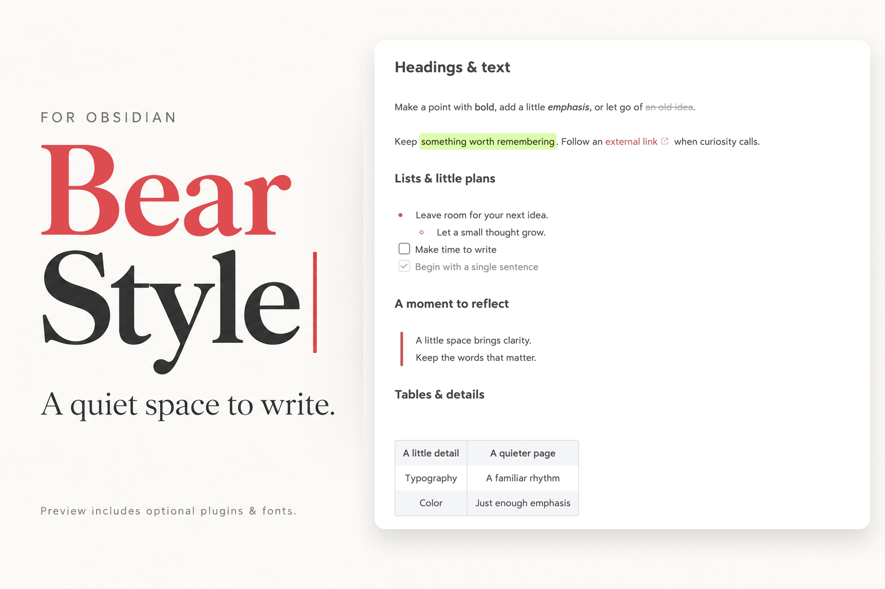
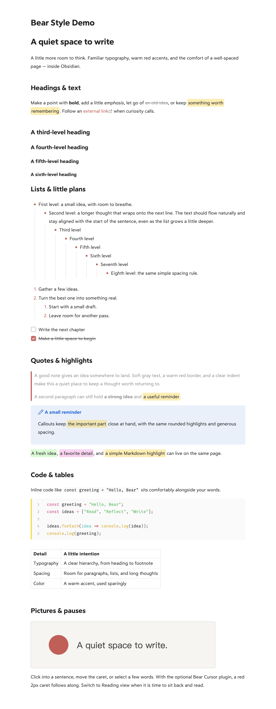
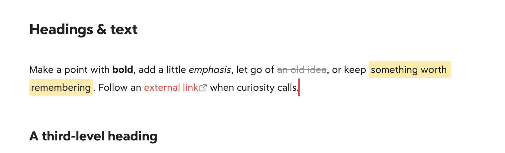

# Bear Style



A quiet space to write. Bear-inspired typography, warm red accents, generous spacing, and an optional red **2px caret** for Obsidian.

[中文说明](README.zh-CN.md) · [Theme store](https://community.obsidian.md/themes/bear-style) · [Download](https://github.com/cherishh/obsidian-bear-style/releases/latest) · [Demo note](examples/Bear%20Style%20Demo.md)

A **standalone Obsidian theme**, with an equivalent CSS snippet for the default theme and an optional desktop cursor plugin. The theme works without community plugins. Install either the theme or the snippet, not both. This first theme release targets **light mode**; dark mode has basic fallbacks but has not been visually calibrated against Bear.

> **Screenshots show the enhanced setup, not the theme alone.** They were captured in Obsidian with **Highlightr** (additional highlight colors), **Code Styler** (code styling and line numbers), and locally installed fonts. The cursor close-ups also use **Bear Cursor** for the 2px caret. Installing the theme does **not** install these plugins or fonts. All are optional; without them, typography, wrapping, code blocks, and the caret may differ. See [Match the screenshots](#match-the-screenshots).

## Install with your AI agent (recommended)

**Bear Style is available in the official theme store.** For the full setup shown here, copy this prompt into an agent with access to your local files and Obsidian, such as Codex or Claude Code:

```text
Install the full Bear Style setup in my vault: theme, Bear Cursor,
Highlightr, Code Styler, and the demo note. Prefer the official theme store.
Follow this guide:
https://raw.githubusercontent.com/cherishh/obsidian-bear-style/main/INSTALL.md

Back up changes, preserve my notes and unrelated settings, and verify the result.
Don't install fonts; explain how that affects the appearance.
Ask for my vault path if needed, and tell me if anything requires my help.
```

The agent follows the [installation guide](INSTALL.md): it finds your vault, installs the store theme and optional plugins, applies the preview settings, and verifies the demo. Fonts are not installed. You do not need to clone this repository or run a build.

For a lighter setup, add **"Install only the theme; skip plugins and the demo."** to the prompt. Prefer doing it yourself? Use the [manual steps](#install-the-style).

## Preview

Captured on September 19, 2026 with the current `main` styles, at 2× resolution.



### Cursor in action

The optional Bear Cursor plugin adds a red **2px caret** in the editor, sized to the current line height.



## Install the style

### Official theme store

1. Open **Settings → Appearance → Themes → Manage**, search **Bear Style**, then install and select it. You can also open the [store listing](https://community.obsidian.md/themes/bear-style) and choose **Add to Obsidian**.
2. Disable the **bear** CSS snippet if you previously used it; the theme replaces it.
3. Use **light mode**, **15px** text, readable line length, and accent **`#DD4C4F`** for the preview proportions. Existing fonts are respected.

The theme works on its own. The agent prompt above also installs the optional plugins; installing through the theme store does not. Check for theme updates in **Settings → Appearance**. Bear Cursor updates remain separate.

If the store is unavailable, download **`theme.css`** and **`manifest.json`** from the same [latest release](https://github.com/cherishh/obsidian-bear-style/releases/latest), place both in `<vault>/.obsidian/themes/Bear Style/`, then select **Bear Style** in Appearance. Use your actual configuration folder if it is not `.obsidian`.

### Alternative: CSS snippet

Download the full **`obsidian-bear-style-v*.zip`** asset from [Releases](https://github.com/cherishh/obsidian-bear-style/releases/latest). Choose the **Default** theme, copy `snippets/bear.css` into your CSS snippets folder, and enable **bear** in **Settings → Appearance → CSS snippets**. Set the accent to `#DD4C4F`; use 15px text as a starting point. Do not enable this snippet together with the Bear Style theme.

No build step, package manager, or theme settings plugin is needed to install either format. See Obsidian's [official CSS snippet instructions](https://help.obsidian.md/snippets).

### Optional: the red 2px caret

1. Download the full ZIP from [Releases](https://github.com/cherishh/obsidian-bear-style/releases/latest), then copy its entire `plugins/bear-cursor` folder to `<your vault>/.obsidian/plugins/bear-cursor/`.
2. Confirm it contains `manifest.json`, `main.js`, and `styles.css` directly inside that folder.
3. Reload Obsidian. Under **Settings → Community plugins**, enable community plugins if needed, then enable **Bear Cursor**.

Bear Cursor is manually installed from this repository; it is not listed in the community plugin directory and does not have automatic updates. For updates, disable it, replace those three files, reload Obsidian, then enable it again.

The plugin uses CodeMirror's editor layer API to draw the primary caret. It follows the current line height, fades gently, and respects reduced-motion preferences. It makes no network requests and stores no settings. Text selections and secondary cursors remain under Obsidian's control.

Without the plugin, the theme or snippet still colors the native caret red; the operating system controls its width. Disable any other cursor replacement plugin and remove old CSS that hides the native caret.

## Match the screenshots

The preview uses **Obsidian 1.13.7 on macOS**, the **Default** theme in **light mode**, and the shared Bear Style CSS snippet that also generates `theme.css`. The English marketplace cover is a designed promotional illustration based on this enhanced setup; the full README screenshots are actual Obsidian captures. The full-length image shows Reading view; the cursor close-up shows Live Preview. No third-party plugin code, fonts, or personal vault configuration is bundled.

| Component | What it contributes | Setup used here |
| --- | --- | --- |
| Bear Style theme / `bear.css` | Typography, lists, gray completed tasks, rounded quotes and highlights, striped tables, link pencils, and native caret color | Included; enable one format |
| [Bear Cursor](plugins/bear-cursor/README.md) | The red 2px primary caret | Included; version 1.0.0; desktop only |
| [Highlightr](https://github.com/chetachiezikeuzor/Highlightr-Plugin) | Green and pink highlights, plus commands to create them | Version 1.2.2; **CSS classes** method, **rounded** style; Green `#D3FFA4`, Pink `#FFB8EBA6` |
| [Code Styler](https://github.com/mayurankv/Obsidian-Code-Styler) | Code block line numbers, syntax colors, and language border | Version 1.1.7; see settings below |
| Text font | Letter shapes and line wrapping | `Bear Sans UI, Bear Sans UI Heading`, 15px; fonts are **not included** |
| Monospace font | Code letter shapes | `Fira Code, Roboto Mono`; fonts are **not included** |
| Obsidian appearance | Task checkboxes and other native accents | Accent `#DD4C4F`, readable line length on |

Install **Highlightr** and **Code Styler** separately through Obsidian's community plugin browser. They are optional: basic Markdown highlights and code blocks still work without them. The snippet supplies Bear's green for `<mark class="hltr-green">`; Highlightr supplies the other named colors and highlighting commands.

For Code Styler, the screenshot setup uses the **Default** preset with line numbers enabled, code block radius **4px**, language border enabled at **4px**, language tag and icon hidden, and inline-code styling disabled. Other settings use the plugin defaults. Later plugin versions may render differently.

Use fonts already available on your system, or select your own. Without the same fonts, the style still works, but text metrics and wrapping will differ. This project does not distribute Bear's fonts or instructions for extracting them. It is an independent project inspired by [Bear](https://bear.app), not affiliated with or endorsed by Bear or Obsidian.

## Try the demo

For English, copy **Bear Style Demo.md** and **quiet-space.svg** from `examples/` into the same folder in your vault. For Chinese, use **Bear 风格演示.md** and **quiet-space-zh.svg** instead. Open your chosen note in Obsidian; keep its matching SVG beside it so the relative image reference resolves.

The demo covers headings H1–H6, bold, italics, strikethrough, links, highlights, eight nested list levels, numbered lists, checkboxes, blockquotes, a callout, inline code, a fenced code block, a table, and an image. It contains only sample text.

## Make it yours

Override the `--bear-*` variables in a small personal CSS snippet, so theme updates do not erase your changes:

```css
--bear-accent: #DD4C4F;
--bear-line-height: 1.8;
--bear-line-width: calc(var(--font-text-size) * 51.5);
--bear-paragraph-spacing: calc(var(--font-text-size) * var(--bear-line-height));
--bear-caret-width: 2px;
```

Keep line-height variables **unitless** (for example, `1.8`, not `1.8em`): plugins can multiply them by a font size. If you change the accent, also update Obsidian's Accent color setting for native controls.

Fonts and base font size stay in Obsidian's Appearance settings. The snippet adjusts muted text and image borders in dark mode while retaining the default theme's background and foreground colors.

## Compatibility & limits

- Tested with **Obsidian 1.13.7 on macOS**, both as a standalone theme and as a snippet on the default theme. Other themes may override the snippet rules.
- Checked in Live Preview and Reading view: heading sizes, lists, quotes, highlights, images, and code layout. The caret was checked in body text, at heading starts, after links, and beside numbered list markers, including native fallback when disabled.
- Dark-mode variable behavior was checked; the screenshots show light mode. Windows, Linux, and physical mobile devices have not been tested.
- The cursor plugin requires **Obsidian 1.13.7 or later** and is **desktop only**. Mobile retains its native caret. Later Obsidian versions are not automatically guaranteed compatible.
- The plugin is designed to leave composition and Vim mode to the editor; IME candidate-window behavior and Vim mode have not been fully tested.

To uninstall the theme, switch to **Default** and remove **Bear Style** in Appearance. For the snippet format, disable **bear**, then delete its CSS file. Disable **Bear Cursor** before deleting its plugin folder. Remove optional third-party plugins only if you no longer use their features. No note content needs to be changed.

## Development

`snippets/bear.css` is the shared stylesheet. `theme.css` is generated from it, with a theme-specific default UI accent. Do not edit the generated file independently. The optional plugin imports Obsidian and CodeMirror from the host application; no JavaScript bundler is needed.

```sh
npm ci
npm run build
npm run check
npm run lint
python3 scripts/package.py
```

Lint uses the official `stylelint-config-obsidianmd` rules. Obsidian/CodeMirror host class names are allowed, and specificity-order lint is disabled for the separate editor/reading branches. Scoped `:has()` selectors retain advisory performance warnings; they support marker spacing, quote ends, image-link exclusions, and cursor fallback.

Theme releases attach `theme.css` and `manifest.json` directly, with a tag exactly matching the manifest version (for example `1.1.0`). The full ZIP additionally contains the optional plugin, both demos, and documentation.

The packager includes only explicitly listed public files. For bug reports, include your Obsidian version, OS, theme, relevant plugins, and a small sample note. Please do not upload your whole vault.

## License

[MIT](LICENSE). Third-party plugins and fonts retain their own licenses.
