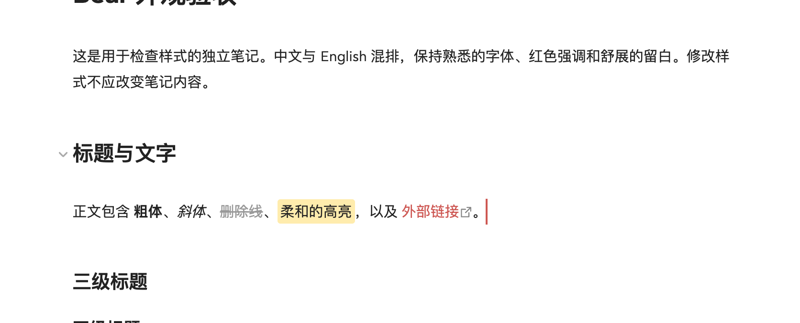

# Bear Style


让 Obsidian 多一点 Bear 的感觉：舒展的排版、温暖的红色强调，以及可选的红色 **2px 光标**。

[English](README.md) · [主题商店](https://community.obsidian.md/themes/bear-style) · [下载](https://github.com/cherishh/obsidian-bear-style/releases/latest) · [中文演示笔记](examples/Bear%20风格演示.md)

这是一个**独立的 Obsidian 主题**，同时保留默认主题使用的 CSS 代码片段和可选桌面端光标插件。基础主题无需社区插件；主题与代码片段二选一即可。首个主题版本以**浅色模式**为目标，暗色模式保留基础回退，但尚未与 Bear 做视觉校准。

> **截图展示的是增强配置，并非只安装主题的效果。** 截图使用了 **Highlightr**（额外高亮颜色）、**Code Styler**（代码样式与行号）以及本地字体；光标特写还使用了 **Bear Cursor**。安装主题**不会自动安装插件或字体**。它们都是可选项，不安装时字形、换行、代码块和光标可能不同。具体配置见[复现截图](#复现截图)。

## 让 AI Agent 帮你安装（推荐）

**Bear Style 已上架官方主题商店。** 想获得截图中的完整配置，把下面的提示词复制给能访问本地文件和 Obsidian 的 Agent，例如 Codex 或 Claude Code：

```text
请在我的 Obsidian 仓库中安装完整的 Bear Style 配置：主题、Bear Cursor、
Highlightr、Code Styler 和演示笔记。主题优先从官方商店安装。
请按照这份指南执行：
https://raw.githubusercontent.com/cherishh/obsidian-bear-style/main/INSTALL.md

备份改动，保留我的笔记与无关设置，并验证安装效果。
不要安装字体；请说明这会对外观产生什么影响。
需要时询问仓库路径；若有操作需要我协助，请告诉我。
```

Agent 会按照[安装指南](INSTALL.md)识别仓库、安装商店主题和可选插件、配置预览样式，并打开演示笔记验证。不安装字体，也不需要你先克隆代码或运行构建命令。

只想要基础样式，在提示词后加一句：**「只安装主题，跳过插件和演示笔记。」** 想自己操作，可以看[手动步骤](#安装样式)。

## 看看效果

以下截图于 2026 年 9 月 19 日使用当前 `main` 样式拍摄，保留 2× 分辨率。


### 光标效果

可选的 Bear Cursor 插件为编辑器提供红色 **2px 光标**，高度随当前行调整。



## 安装样式

### 官方主题商店

1. 打开「**设置 → 外观 → 主题 → 管理**」，搜索 **Bear Style**，安装并使用。也可以在[商店页面](https://community.obsidian.md/themes/bear-style)点击 **Add to Obsidian**。
2. 如果之前启用了 **bear** CSS 代码片段，请关闭它；正式主题已包含相同样式。
3. 使用**浅色模式、15px 正文、缩减栏宽**和强调色 **`#DD4C4F`** 来接近预览比例，保留已有字体。

主题可以独立使用。上面的 Agent 提示词还会安装可选插件，主题商店不会自动安装它们。主题更新可在「设置 → 外观」中检查；Bear Cursor 需要单独更新。

如果商店不可用，从同一个[最新 Release](https://github.com/cherishh/obsidian-bear-style/releases/latest) 下载 **`theme.css`** 与 **`manifest.json`**，放入 `<仓库>/.obsidian/themes/Bear Style/`，再到外观设置选择 **Bear Style**。如果自定义了配置文件夹，请用实际路径代替 `.obsidian`。

### 另一种方式：CSS 代码片段

从 [Releases](https://github.com/cherishh/obsidian-bear-style/releases/latest) 下载完整的 **`obsidian-bear-style-v*.zip`** 附件，选择 **Default 默认主题**，把 `snippets/bear.css` 放入代码片段文件夹，并在「设置 → 外观 → CSS 代码片段」中启用 **bear**。强调色设为 `#DD4C4F`，正文可从 15px 开始。不要同时启用 Bear Style 主题和这份代码片段。

两种方式都无需编译、包管理器或主题设置插件。也可参考 [Obsidian 官方说明](https://help.obsidian.md/snippets)。

### 可选：红色 2px 光标

从 [Releases](https://github.com/cherishh/obsidian-bear-style/releases/latest) 下载完整 ZIP，把其中的整个 `plugins/bear-cursor` 文件夹复制到 `<你的仓库>/.obsidian/plugins/bear-cursor/`。确认其中直接包含 `manifest.json`、`main.js` 和 `styles.css`，重新加载 Obsidian，在社区插件中开启 **Bear Cursor**。

这个插件需要从本仓库手动安装，尚未进入社区插件目录，也不会自动更新。更新时先关闭插件，替换以上三个文件，重新加载 Obsidian 后再开启。

插件通过 CodeMirror 编辑器的 layer API 绘制主光标，高度跟随当前行，并支持系统的减少动态效果设置。它不访问网络、不写入文件、不保存设置。未安装插件时，CSS 仍会将原生光标设为红色，但宽度由系统决定。请关闭其他光标替换插件，并移除旧的隐藏原生光标的 CSS。

## 复现截图

截图使用 **macOS、Obsidian 1.13.7、默认主题、浅色模式**，加上与正式主题共享的 Bear Style CSS。英文市场封面是基于这一增强配置设计的宣传插画；README 中的完整截图则来自 Obsidian 实际界面。长图展示阅读视图，光标特写展示实时阅览。仓库不附带第三方插件代码、字体或个人配置。

| 组件 | 作用 | 截图使用的配置 |
| --- | --- | --- |
| Bear Style 主题 / `bear.css` | 排版、列表、灰色完成项、圆角引用与高亮、条纹表格、外部链接图标和原生光标颜色 | 本仓库提供，二选一 |
| [Bear Cursor](plugins/bear-cursor/README.md) | 红色 2px 光标 | 本仓库提供，1.0.0，限桌面端 |
| [Highlightr](https://github.com/chetachiezikeuzor/Highlightr-Plugin) | 多色高亮及高亮命令 | 1.2.2，CSS classes 模式、rounded 样式；Green `#D3FFA4`、Pink `#FFB8EBA6` |
| [Code Styler](https://github.com/mayurankv/Obsidian-Code-Styler) | 代码块行号、语法配色和语言边框 | 1.1.7，具体设置见下方 |
| 正文字体 | 字形和换行位置 | `Bear Sans UI, Bear Sans UI Heading`，15px；字体不随项目分发 |
| 等宽字体 | 代码字形 | `Fira Code, Roboto Mono`；字体不随项目分发 |
| Obsidian 外观 | 原生控件和任务框 | 强调色 `#DD4C4F`，开启「缩减栏宽」 |

Highlightr 和 Code Styler 可在 Obsidian 社区插件中单独安装，都是可选项。基础 Markdown 高亮和代码块不依赖它们；CSS 已提供 `hltr-green` 的 Bear 绿色；其他命名颜色和高亮命令由 Highlightr 提供。

Code Styler 从 **Default** 预设开始：开启行号，代码块圆角 **4px**，开启语言边框并设为 **4px**，隐藏语言标签和图标，关闭行内代码样式。其余使用默认设置。后续插件版本可能呈现不同效果。

使用自己系统中可用的字体即可；字体不同，字形和换行会有所差异。本项目不分发 Bear 字体，也不提供提取字体的说明。这是受 [Bear](https://bear.app) 启发的独立项目，与 Bear、Obsidian 官方无关联。

## 试用演示笔记

将 `examples/` 中的 **Bear 风格演示.md** 和 **quiet-space-zh.svg** 放到你仓库的同一个文件夹，再打开中文演示笔记。图片使用相对路径，请保留配套 SVG。英文版本则使用 **Bear Style Demo.md** 和 **quiet-space.svg**。

演示包含六级标题、粗体、斜体、删除线、链接、高亮、八层列表、有序列表、任务、引用、提示框、行内代码、代码块、表格及图片。全部为示例内容。

## 调整外观

用一份个人 CSS 代码片段覆盖 `--bear-*` 变量，避免主题更新覆盖自己的修改：

```css
--bear-accent: #DD4C4F;
--bear-line-height: 1.8;
--bear-line-width: calc(var(--font-text-size) * 51.5);
--bear-paragraph-spacing: calc(var(--font-text-size) * var(--bear-line-height));
--bear-caret-width: 2px;
```

行高必须是**无单位数字**，例如 `1.8`，不能写成 `1.8em`；部分插件会将其与字体尺寸相乘。修改强调色时，也请修改 Obsidian 外观设置中的强调色。字体和正文字号仍在 Obsidian 设置中调整。

暗色模式只额外调整次要文字与图片边框，保留默认主题的正文和背景颜色。

## 兼容性与卸载

- 已在 macOS、Obsidian 1.13.7、默认主题下检查实时阅览和阅读视图中的排版、列表、引用、高亮、图片与代码。
- 已检查正文、标题前、链接后、有序列表旁的光标，以及关闭插件后的原生光标回退。
- 已检查暗色变量行为；展示截图为浅色模式。Windows、Linux 和实体移动设备尚未测试。
- 光标插件最低要求 Obsidian **1.13.7**，仅限桌面端。手机保留原生光标，后续 Obsidian 版本仍可能需要适配。
- 插件设计上会把输入法组合输入与 Vim 模式交给编辑器；输入法候选框行为及 Vim 模式尚未完整验证。

卸载主题时，先切回 **Default**，再在外观设置中移除 **Bear Style**。如果使用代码片段方式，则关闭 **bear** 后再删除 CSS。先关闭 **Bear Cursor**，再删除插件文件夹。第三方插件是否移除取决于你是否仍使用它们的功能；无需修改笔记内容。

## 开发与许可

`snippets/bear.css` 是共享样式源，`theme.css` 由脚本生成，额外提供默认 UI 强调色。不要单独修改生成文件。光标插件使用 Obsidian 提供的模块，无需 JavaScript 打包器。

```sh
npm ci
npm run build
npm run check
npm run lint
python3 scripts/package.py
```

检查使用官方 `stylelint-config-obsidianmd`；适配宿主类名，并关闭针对编辑/阅读分支的选择器顺序检查。少量限定范围的 `:has()` 保留性能建议警告，用于列表间距、引用末端、图片链接排除和光标回退。

主题 Release 单独附上 `theme.css` 与 `manifest.json`，标签与 manifest 版本完全一致（如 `1.1.0`）。完整 ZIP 另含可选插件、中英文演示及文档。

打包脚本仅包含明确列出的公开文件。反馈问题请提供版本、系统、主题、相关插件及最小示例，不要上传整个私人仓库。

采用 [MIT 许可](LICENSE)。第三方插件和字体保留各自许可。
