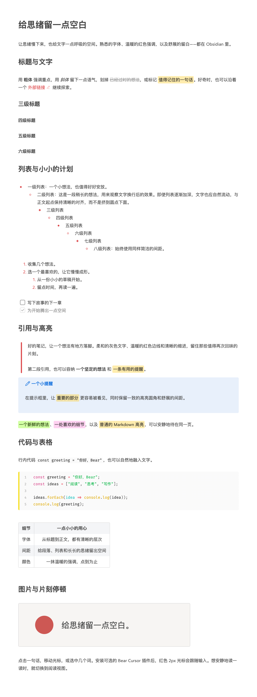

# Obsidian Bear Style

让 Obsidian 多一点 Bear 的感觉：舒展的排版、温暖的红色强调，以及可选的红色 **2px 光标**。

[English](README.md) · [下载](https://github.com/cherishh/obsidian-bear-style/releases/latest) · [中文演示笔记](examples/Bear%20风格演示.md)

这是为 **Obsidian 默认主题**编写的 CSS 代码片段，另附一个可选的桌面端光标插件。基础样式无需社区插件；本项目目前不是社区主题商店中的完整主题。

> 下方长图是在 Obsidian 中截取的完整中文演示。要接近截图效果，还需要相同字体及可选的 **Highlightr**（彩色高亮）、**Code Styler**（代码块）。**Bear Cursor** 则为编辑时提供加粗红色光标。只安装 CSS 不会复现每一个细节。

## 让 AI Agent 帮你安装

复制下面的提示词给能访问本地文件和 Obsidian 的 Agent，例如 Codex 或 Claude Code：

```text
请在我的 Obsidian 仓库中安装完整的 Bear Style 配置：CSS、Bear Cursor、
Highlightr、Code Styler 和演示笔记。请按照这份指南执行：
https://raw.githubusercontent.com/cherishh/obsidian-bear-style/main/INSTALL.md

备份改动，保留我的笔记与无关设置，并验证安装效果。
不要安装字体；请说明这会对外观产生什么影响。
需要时询问仓库路径；若有操作需要我协助，请告诉我。
```

Agent 会自行阅读[详细安装指南](INSTALL.md)，无需复制长篇说明。只安装 CSS 可以使用[手动步骤](#安装样式)。

## 看看效果



## 安装样式

1. 从 [Releases](https://github.com/cherishh/obsidian-bear-style/releases/latest) 下载并解压 **`obsidian-bear-style-v1.0.1.zip`**。
2. 在 Obsidian 的「设置 → 外观」中选择**默认主题**。
3. 找到「CSS 代码片段」，点击文件夹按钮，将下载包中的 `snippets/bear.css` 放进去。
4. 返回 Obsidian，必要时刷新列表，然后开启 **bear**。
5. 将外观中的强调色设为 **`#cd5853`**，正文字号可以从 **15px** 开始。

不需要编译、包管理器或主题设置插件。也可参考 [Obsidian 官方说明](https://help.obsidian.md/snippets)。

### 可选：红色 2px 光标

把下载包里的整个 `plugins/bear-cursor` 文件夹复制到 `<你的仓库>/.obsidian/plugins/bear-cursor/`。确认其中直接包含 `manifest.json`、`main.js` 和 `styles.css`，重新加载 Obsidian，在社区插件中开启 **Bear Cursor**。

这个插件需要从本仓库手动安装，尚未进入社区插件目录，也不会自动更新。更新时先关闭插件，替换以上三个文件，重新加载 Obsidian 后再开启。

插件通过 CodeMirror 编辑器的 layer API 绘制主光标，高度跟随当前行，并支持系统的减少动态效果设置。它不访问网络、不写入文件、不保存设置。未安装插件时，CSS 仍会将原生光标设为红色，但宽度由系统决定。请关闭其他光标替换插件，并移除旧的隐藏原生光标的 CSS。

## 复现截图

截图使用 **macOS、Obsidian 1.13.7、默认主题、浅色模式**。长图展示阅读视图，因此不显示编辑光标。仓库不附带第三方插件代码、字体或个人配置。

| 组件 | 作用 | 截图使用的配置 |
| --- | --- | --- |
| `bear.css` | 标题比例、间距、列表、引用、高亮圆角、图片边框和光标颜色 | 本仓库提供 |
| [Bear Cursor](plugins/bear-cursor/README.md) | 红色 2px 光标 | 本仓库提供，1.0.0，限桌面端 |
| [Highlightr](https://github.com/chetachiezikeuzor/Highlightr-Plugin) | 多色高亮及高亮命令 | 1.2.2，CSS classes 模式、rounded 样式；Green `#BBFABBA6`、Pink `#FFB8EBA6` |
| [Code Styler](https://github.com/mayurankv/Obsidian-Code-Styler) | 代码块行号、语法配色和语言边框 | 1.1.7，具体设置见下方 |
| 正文字体 | 字形和换行位置 | `Bear Sans UI, Bear Sans UI Heading`，15px；字体不随项目分发 |
| 等宽字体 | 代码字形 | `Fira Code, Roboto Mono`；字体不随项目分发 |
| Obsidian 外观 | 原生控件和任务框 | 强调色 `#cd5853`，开启「缩减栏宽」 |

Highlightr 和 Code Styler 可在 Obsidian 社区插件中单独安装，都是可选项。基础 Markdown 高亮和代码块不依赖它们；演示中的 `hltr-green`、`hltr-pink` 彩色高亮需要 Highlightr 提供相应样式。

Code Styler 从 **Default** 预设开始：开启行号，代码块圆角 **4px**，开启语言边框并设为 **4px**，隐藏语言标签和图标，关闭行内代码样式。其余使用默认设置。后续插件版本可能呈现不同效果。

使用自己系统中可用的字体即可；字体不同，字形和换行会有所差异。本项目不分发 Bear 字体，也不提供提取字体的说明。这是受 [Bear](https://bear.app) 启发的独立项目，与 Bear、Obsidian 官方无关联。

**无需 Ninja Cursor、Minimal Theme Settings 或 Style Settings。**

## 试用演示笔记

将 `examples/` 中的 **Bear 风格演示.md** 和 **quiet-space-zh.svg** 放到你仓库的同一个文件夹，再打开中文演示笔记。图片使用相对路径，请保留配套 SVG。英文版本则使用 **Bear Style Demo.md** 和 **quiet-space.svg**。

演示包含六级标题、粗体、斜体、删除线、链接、高亮、八层列表、有序列表、任务、引用、提示框、行内代码、代码块、表格及图片。全部为示例内容。

## 调整外观

编辑 `snippets/bear.css` 顶部的 `--bear-*` 变量：

```css
--bear-accent: #cd5853;
--bear-line-height: 1.8;
--bear-line-width: 700px;
--bear-paragraph-spacing: 1rem;
--bear-caret-width: 2px;
```

行高必须是**无单位数字**，例如 `1.8`，不能写成 `1.8em`；部分插件会将其与字体尺寸相乘。修改强调色时，也请修改 Obsidian 外观设置中的强调色。字体和正文字号仍在 Obsidian 设置中调整。

暗色模式只额外调整次要文字与图片边框，保留默认主题的正文和背景颜色。

## 兼容性与卸载

- 已在 macOS、Obsidian 1.13.7、默认主题下检查实时阅览和阅读视图中的排版、列表、引用、高亮、图片与代码。
- 已检查正文、标题前、链接后、有序列表旁的光标，以及关闭插件后的原生光标回退。
- 已检查暗色变量行为；展示截图为浅色模式。Windows、Linux 和实体移动设备尚未测试。
- 光标插件最低要求 Obsidian **1.13.7**，仅限桌面端。手机保留原生光标，后续 Obsidian 版本仍可能需要适配。
- 插件设计上会把输入法组合输入与 Vim 模式交给编辑器；输入法候选框行为及 Vim 模式尚未完整验证。

卸载时先关闭 **bear** 代码片段，再删除 CSS。先关闭 **Bear Cursor**，再删除插件文件夹。第三方插件是否移除取决于你是否仍使用它们的功能；无需修改笔记内容。

## 开发与许可

插件直接使用 Obsidian 提供的模块，仓库中的 JavaScript 即可运行，无需打包器。生成下载包：

```sh
python3 scripts/package.py
```

打包脚本仅包含明确列出的公开文件。反馈问题请提供版本、系统、主题、相关插件及最小示例，不要上传整个私人仓库。

采用 [MIT 许可](LICENSE)。第三方插件和字体保留各自许可。
