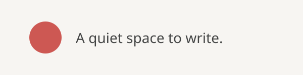

# A quiet space to write

A little more room to think. Familiar typography, warm red accents, and the comfort of a well-spaced page — inside Obsidian.

## Headings & text

Make a point with **bold**, add a little *emphasis*, let go of ~~an old idea~~, or keep ==something worth remembering==. Follow an [external link](https://bear.app) when curiosity calls.

### A third-level heading
#### A fourth-level heading
##### A fifth-level heading
###### A sixth-level heading

## Lists & little plans

- First level: a small idea, with room to breathe.
  - Second level: a longer thought that wraps onto the next line. The text should flow naturally and stay aligned with the start of the sentence, even as the list grows a little deeper.
    - Third level
      - Fourth level
        - Fifth level
          - Sixth level
            - Seventh level
              - Eighth level: the same simple spacing rule.

1. Gather a few ideas.
2. Turn the best one into something real.
   1. Start with a small draft.
   2. Leave room for another pass.

- [ ] Write the next chapter
- [x] Make a little space to begin

## Quotes & highlights

> A good note gives an idea somewhere to land. Soft gray text, a warm red border, and a clear indent make this a quiet place to keep a thought worth returning to.
>
> A second paragraph can still hold **a strong idea** and ==a useful reminder==.

> [!note] A small reminder
> Callouts keep ==the important part== close at hand, with the same rounded highlights and generous spacing.

<mark class="hltr-green">A fresh idea</mark>, <mark class="hltr-pink">a favorite detail</mark>, and ==a simple Markdown highlight== can live on the same page.

## Code & tables

Inline code like `const greeting = "Hello, Bear"` sits comfortably alongside your words.

```javascript
const greeting = "Hello, Bear";
const ideas = ["Read", "Reflect", "Write"];

ideas.forEach(idea => console.log(idea));
console.log(greeting);
```

| Detail | A little intention |
| --- | --- |
| Typography | A clear hierarchy, from heading to footnote |
| Spacing | Room for paragraphs, lists, and long thoughts |
| Color | A warm accent, used sparingly |

## Pictures & pauses



Click into a sentence, move the caret, or select a few words. With the optional Bear Cursor plugin, a red 2px caret follows along. Switch to Reading view when it is time to sit back and read.
