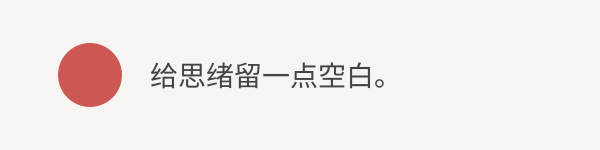

# 给思绪留一点空白

让思绪慢下来，也给文字一点呼吸的空间。熟悉的字体、温暖的红色强调，以及舒展的留白——都在 Obsidian 里。

## 标题与文字

用 **粗体** 强调重点，用 *斜体* 留下一点语气，划掉 ~~已经过时的想法~~，或标记 ==值得记住的一句话==。好奇时，也可以沿着一个 [外部链接](https://bear.app) 继续探索。

### 三级标题
#### 四级标题
##### 五级标题
###### 六级标题

## 列表与小小的计划

- 一级列表：一个小想法，也值得好好安放。
  - 二级列表：这是一段稍长的想法，用来观察文字换行后的效果。即使列表逐渐加深，文字也应自然流动，与正文起点保持清晰的对齐，而不是挤到圆点下面。
    - 三级列表
      - 四级列表
        - 五级列表
          - 六级列表
            - 七级列表
              - 八级列表：始终使用同样简洁的间距。

1. 收集几个想法。
2. 选一个最喜欢的，让它慢慢成形。
   1. 从一份小小的草稿开始。
   2. 留点时间，再读一遍。

- [ ] 写下故事的下一章
- [x] 为开始腾出一点空间

## 引用与高亮

> 好的笔记，让一个想法有地方落脚。柔和的灰色文字、温暖的红色边线和清晰的缩进，留住那些值得再次回味的片刻。
>
> 第二段引用，也可以容纳 **一个坚定的想法** 和 ==一条有用的提醒==。

> [!note] 一个小提醒
> 在提示框里，让 ==重要的部分== 更容易被看见，同时保留一致的高亮圆角和舒展的间距。

<mark class="hltr-green">一个新鲜的想法</mark>、<mark class="hltr-pink">一处喜欢的细节</mark>，以及 ==普通的 Markdown 高亮==，可以安静地待在同一页。

## 代码与表格

行内代码 `const greeting = "你好，Bear"`，也可以自然地融入文字。

```javascript
const greeting = "你好，Bear";
const ideas = ["阅读", "思考", "写作"];

ideas.forEach(idea => console.log(idea));
console.log(greeting);
```

| 细节 | 一点小小的用心 |
| --- | --- |
| 字体 | 从标题到正文，都有清晰的层次 |
| 间距 | 给段落、列表和长长的思绪留出空间 |
| 颜色 | 一抹温暖的强调，点到为止 |

## 图片与片刻停顿



点击一句话，移动光标，或选中几个词。安装可选的 Bear Cursor 插件后，红色 2px 光标会跟随输入。想安静地读一读时，就切换到阅读视图。
